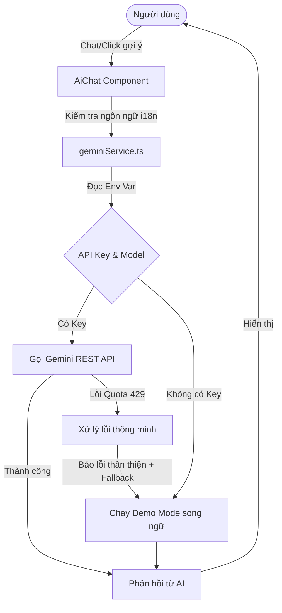

# Tài liệu Tích hợp AI Portfolio Assistant (Gemini API)

Tài liệu này giải thích chi tiết về giải pháp tích hợp trí tuệ nhân tạo (AI) vào Personal Portfolio của Dương Nguyễn, hỗ trợ giải đáp thông tin về các dự án trong danh mục **Projects**.

---

## 1. Tổng quan Kiến trúc

Hệ thống sử dụng **Gemini REST API** trực tiếp từ trình duyệt mà không cần cài đặt các thư viện SDK nặng nề. Điều này giúp tối ưu hóa bundle size và tương thích hoàn toàn với các nền tảng static hosting như Vercel.

---

## 2. Thiết lập Biến môi trường (Environment Variables)

Các thông số API và Model được tách biệt hoàn toàn vào file `.env` hoặc `.env.local` để dễ dàng thay đổi mà không cần build lại mã nguồn:

- `VITE_GEMINI_API_KEY`: API Key lấy từ Google AI Studio.
- `VITE_GEMINI_MODEL`: Model Gemini được cấu hình (ví dụ: `gemini-2.0-flash` hoặc `gemini-1.5-flash`).
- `VITE_GEMINI_BASE`: Điểm cuối API (Base Endpoint) của Google API.

*File mẫu cấu hình nằm tại: [`.env.local.example`](file:///e:/personal-portfolio/.env.local.example)*

---

## 3. Các cơ chế xử lý thông minh

### 3.1. Xử lý Lỗi Quota / Rate Limit (429) Graceful
Khi sử dụng Gemini API miễn phí, việc bị vượt quá số lượng request hoặc token là rất phổ biến. Trợ lý AI được thiết kế để bắt các lỗi quota một cách tinh tế:
- **Phát hiện lỗi**: Sử dụng Regex kiểm tra thông điệp lỗi (`/quota|rate-limit|limit|exhausted|429/i`).
- **Hiển thị thân thiện**: Thay vì in ra lỗi thô kệch (stack trace của API), chatbot sẽ hiển thị thông báo nhẹ nhàng bằng ngôn ngữ hiện tại của ứng dụng.
- **Tự động Fallback**: Kết hợp hiển thị câu trả lời từ **Demo Mode** ngay lập tức để người dùng không cảm thấy ứng dụng bị lỗi hay không phản hồi.

### 3.2. Hỗ trợ Song ngữ hoàn chỉnh (i18n Dynamic)
Chatbot đồng bộ ngôn ngữ chặt chẽ với trạng thái hiện tại của portfolio:
- **Gợi ý tự động (Chips)**: Thay đổi giữa Tiếng Anh và Tiếng Việt khi người dùng chuyển đổi ngôn ngữ của trang web, tập trung vào việc hỏi đáp chung về toàn bộ danh sách dự án.
- **Demo Response dịch thuật chuẩn xác**: Các câu trả lời demo được viết riêng biệt cho từng ngôn ngữ, đảm bảo hành văn tự nhiên, chuyên nghiệp và tuyệt đối không chèn ép các cụm từ tiếng Anh không tự nhiên vào văn cảnh tiếng Việt.
- **Reset lịch sử thông minh**: Khi người dùng đổi ngôn ngữ của portfolio, lịch sử chat sẽ được reset để bắt đầu một hội thoại mới chuẩn xác hơn theo ngôn ngữ mới.

---

## 4. Nội dung huấn luyện (System Instruction)

System Prompt của trợ lý AI được tối ưu hóa để tập trung giới thiệu thế mạnh của Dương Nguyễn, bao gồm:
1. **Thông tin cá nhân & Liên hệ**: Định dạng email, LinkedIn, GPA.
2. **Kỹ năng chuyên môn**: Chia rõ ràng theo Backend (Spring Boot, Java), Frontend (React, NextJS), AI/Data (Gemini, AWS Bedrock, Prophet Model), DevOps.
3. **Danh mục dự án (PROJECTS)**: Huấn luyện AI phản hồi bao quát và cân bằng về tất cả các dự án của Dương (HRMPro, Sports Facility, E-commerce, Chat App, LIMS) mà không tập trung thiên lệch riêng lẻ vào một dự án cụ thể nào.

---

## 5. Hướng dẫn Deploy lên Production (Vercel)

Khi đưa dự án lên Vercel, hãy cấu hình các biến môi trường sau trong phần **Project Settings > Environment Variables**:

| Key | Value |
|---|---|
| `VITE_GEMINI_API_KEY` | *API Key của bạn* |
| `VITE_GEMINI_MODEL` | `gemini-2.0-flash` |
| `VITE_GEMINI_BASE` | `https://generativelanguage.googleapis.com/v1beta/models` |
